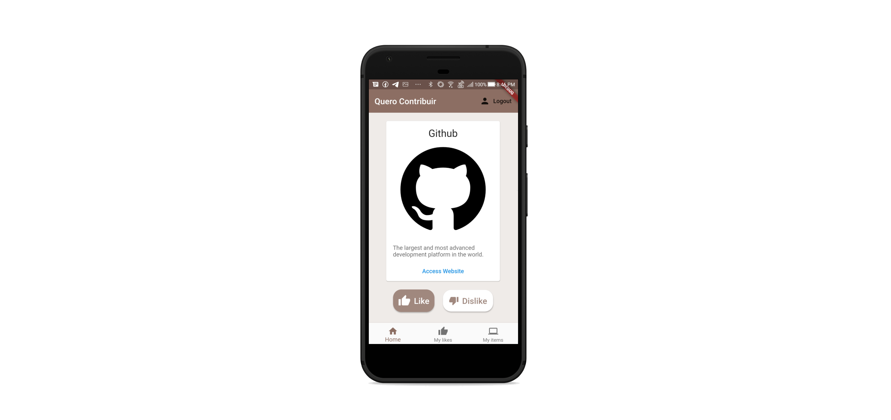

<h1 align="center">
    
</h1>

  
  
  

  

  <a href="#rocket-built-with">Built with</a>&nbsp;&nbsp;&nbsp;|&nbsp;&nbsp;&nbsp;
  <a href="#-about-the-project">About the project</a>&nbsp;&nbsp;&nbsp;|&nbsp;&nbsp;&nbsp;
  <a href="#-how-to-contribute">How to contribute</a>&nbsp;&nbsp;&nbsp;|&nbsp;&nbsp;&nbsp;
  <a href="#memo-license">License</a>

 

  

Um aplicativo desenvolvido usando Flutter e Firebase, cujo objetivo é viabilizar a introdução de desenvolvedores ao mundo do software livre de maneira mais simples.

## Quero Contribuir

Primeiramente, é necessário instalar o [Flutter](https://flutter.dev/docs/get-started/install) e configurar o [emulador](https://developer.android.com/studio/run/emulator) e o [editor de texto](https://code.visualstudio.com/download) de sua preferência.

Daí, basta rodar os comandos:

    flutter pub get

    flutter pub upgrade

    flutter run

Caso não tenha ficado claro pelo nome, contribuições são bem vindas 😁!